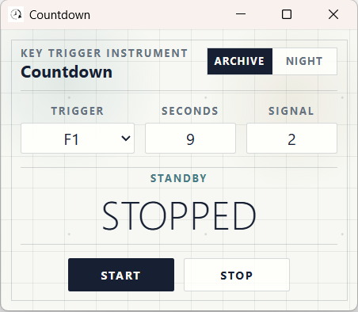
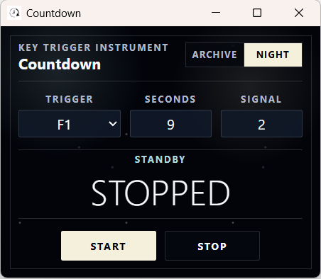
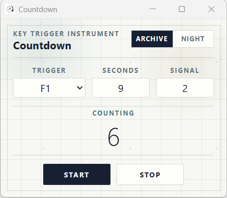

# Key Trigger Countdown

Key Trigger Countdown is a compact Windows countdown tool built with Tauri. It runs as a small desktop window, listens for a selected global key, and restarts the countdown when that key is pressed while the timer is running.

It is useful when you need a repeatable countdown that can be reset without focusing the app, such as timing repeated actions, practice loops, game mechanics, stream cues, or any workflow where your hands are already on the keyboard.

## Screenshots

### Archive Sheet

Archive Sheet is the default theme. It uses a light chart-paper surface, precise grid lines, and a compact instrument layout.



### Night Atlas

Night Atlas keeps the same layout but switches to a deep-space palette for low-light use.



### Counting

When the timer is running, the status changes to `COUNTING` and the large readout shows the remaining seconds.



## What It Does

- Runs a countdown from the number in `Seconds`.
- Plays a tick sound when the remaining time is less than or equal to the value in `Signal`.
- Listens for the selected trigger key globally, even when another window is focused.
- Restarts the countdown when the selected trigger key is pressed while the timer is running.
- Provides two UI themes: `Archive` and `Night`.

## How To Use

1. Open the app.
2. Choose a trigger key from the `Trigger` dropdown.
3. Enter the countdown duration in `Seconds`.
4. Enter the sound threshold in `Signal`.
5. Click `Start`.
6. While the timer is running, press the selected trigger key to restart the countdown.
7. Click `Stop` to stop the timer and return to standby.

Example: with `Trigger = F1`, `Seconds = 9`, and `Signal = 2`, clicking `Start` begins a 9-second countdown. When the remaining time reaches 2 seconds or lower, the tick sound plays. Pressing `F1` while the timer is running restarts the countdown from 9.

## Supported Trigger Keys

The app currently supports:

- Function keys: `F1` through `F12`
- Number keys: `D0` through `D9`

`D0` through `D9` refer to the top-row number keys.

## Themes

Use the theme switch in the top-right corner:

- `Archive`: light chart-paper theme, enabled by default.
- `Night`: dark atlas theme for dimmer environments.

The theme switch only changes the interface appearance. It does not change countdown behavior.

## Build From Source

Requirements:

- Node.js
- Rust
- Tauri prerequisites for Windows

Install dependencies:

```powershell
npm install
```

Run in development mode:

```powershell
npm run tauri dev
```

Build a release app and installers:

```powershell
npm run tauri build
```

After building on Windows, the app executable is generated at:

```text
src-tauri/target/release/key-trigger-countdown.exe
```

Installers are generated under:

```text
src-tauri/target/release/bundle/
```

## Release Workflow

GitHub Actions includes a manual release workflow at:

```text
.github/workflows/release.yml
```

Open the workflow in GitHub Actions and run it manually.

Version behavior:

- If you provide a `version` input, that exact semantic version is used.
- If you leave `version` blank, the workflow generates `1.0.<GitHub run number>`.
- The generated version is applied only inside the CI runner before building. It is not committed back to the repository.
- The GitHub release tag is created as `v<version>`, for example `v1.0.37`.

The workflow builds the Windows Tauri app and uploads the generated installer assets to a GitHub Release. By default, it creates a draft release so you can review the assets before publishing.

Current platform note: this app currently targets Windows because the global background trigger is implemented with a Windows low-level keyboard hook.

## Project Structure

```text
src/
  main.ts       App behavior and countdown logic
  styles.css    Archive Sheet and Night Atlas UI

src-tauri/
  src/lib.rs    Tauri setup and Windows global keyboard hook
  tauri.conf.json

public/
  tick.wav      Countdown signal sound
```

## Notes

The global trigger is implemented with a Windows low-level keyboard hook in Rust. The hook observes supported key presses and sends them to the Tauri frontend; it does not block or consume the key event.
